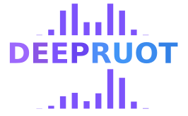

<!-- PROJECT LOGO -->
<br />
<div align="center">
  <a href="https://github.com/zhenyiizhang/DeepRUOT/">
    
  </a>


<h3 align="center">Learning stochastic dynamics from snapshots through regularized unbalanced optimal transport (ICLR'25)</h3>

[Paper Link](https://openreview.net/forum?id=gQlxd3Mtru)

[](https://pytorch.org/get-started/locally/)
[](https://github.com/zhenyiizhang/DeepRUOT/blob/main/LICENSE)
[](https://github.com/zhenyiizhang/DeepRUOT/)

</div>

## Introduction
Reconstructing dynamics using samples from sparsely time-resolved snapshots is an important problem in both natural sciences and machine learning. Here, we introduce a new deep learning approach for solving regularized unbalanced optimal transport (RUOT) and inferring continuous unbalanced stochastic dynamics from observed snapshots. Based on the RUOT form, our method models these dynamics without requiring prior knowledge of growth and death processes or additional information, allowing them to be learnt directly from data. Theoretically, we explore the connections between the RUOT and Schrödinger bridge problem and discuss the key challenges and potential solutions. The effectiveness of our method is demonstrated with a synthetic gene regulatory network, high-dimensional Gaussian Mixture Model, and single-cell RNA-seq data from blood development. Compared with other methods, our approach accurately identifies growth and transition patterns, eliminates false transitions, and constructs the Waddington developmental landscape.

<br />
<div align="left">
  <a href="https://github.com/zhenyiizhang/DeepRUOT/">
    
  </a>

</div>

## Getting Started

1. You can create a new conda environment (DeepRUOT) using

```vim
conda create -n DeepRUOT python=3.10 ipykernel -y
conda activate DeepRUOT
```

2. Install requirements and DeepRUOT
```vim
pip install -r requirements.txt
cd path_to_DeepRUOT
pip install -e .
```


## Contact information

- Zhenyi Zhang (SMS, PKU)-[zhenyizhang@stu.pku.edu.cn](mailto:zhenyizhang@stu.pku.edu.cn)
- Peijie Zhou (CMLR, PKU) (Corresponding author)-[pjzhou@pku.edu.cn](mailto:pjzhou@pku.edu.cn)
- Tiejun Li (SMS & CMLR, PKU) (Corresponding author)-[tieli@pku.edu.cn](mailto:tieli@pku.edu.cn)

## How to cite

If you find this package helpful in your research, we would greatly appreciate it if you could consider citing our following work. We would first like to recommend our new package CytoBridge (https://github.com/zhenyiizhang/CytoBridge), a comprehensive and user-friendly toolkit for dynamical optimal transport and spatiotemproal transcriptomic data that we are actively developing.

The first two papers are our surveys.

- Zhenyi Zhang, Zihan Wang, Yuhao Sun, Jiantao Shen, Qiangwei Peng, Tiejun Li, and Peijie Zhou. “Deciphering cell-fate trajectories using spatiotemporal single-cell transcriptomic data“.  *npj Syst Biol Appl 2025*. (https://www.nature.com/articles/s41540-025-00624-9) 
- Zhenyi Zhang, Yuhao Sun, Qiangwei Peng, Tiejun Li, and Peijie Zhou. “Integrating Dynamical Systems Modeling with Spatiotemporal scRNA-Seq Data Analysis”. In: *Entropy* 27.5, 2025b. ISSN: 1099-4300.

These papers present the core algorithm on which this package is built, as well as other relevant developments.

- Zhenyi Zhang, Tiejun Li, and Peijie Zhou. “Learning stochastic dynamics from snapshots through regularized unbalanced optimal transport”. In: *ICLR 2025 Oral*.
- Zhenyi Zhang, Zihan Wang, Yuhao Sun, Tiejun Li, and Peijie Zhou. “Modeling Cell Dynamics and Interactions with Unbalanced Mean Field Schrödinger Bridge”. In: *NeurIPS 2025*.
- Dongyi Wang, Yuanwei Jiang, Zhenyi Zhang, Xiang Gu, Peijie Zhou, and Jian Sun. “Joint Velocity-Growth Flow Matching for Single-Cell Dynamics Modeling”. In: *NeurIPS 2025*.

Additional related papers may be cited as needed.
- Yuhao Sun, Zhenyi Zhang, Zihan Wang, Tiejun Li, and Peijie Zhou. “Variational Regularized Unbalanced Optimal Transport: Single Network, Least Action”. In: *NeurIPS 2025*.
- Qiangwei Peng, Peijie Zhou, and Tiejun Li. “stVCR: Reconstructing spatio-temporal dynamics of cell development using optimal transport”. In: *Nature Methods*.


## Acknowledgments

We thank the following projects for their great work to make our code possible: [MIOFlow](https://github.com/KrishnaswamyLab/MIOFlow/tree/main), [TorchCFM](https://github.com/atong01/conditional-flow-matching).

## License
DeepRUOT is licensed under the MIT License, and the code from MIOflow used in this project is subject to the Yale Non-Commercial License.

```
License

Copyright (c) 2025 Zhenyi Zhang

Permission is hereby granted, free of charge, to any person obtaining a copy
of this software and associated documentation files (the "Software"), to deal
in the Software without restriction, including without limitation the rights
to use, copy, modify, merge, publish, distribute, sublicense, and/or sell
copies of the Software, and to permit persons to whom the Software is
furnished to do so, subject to the following conditions:

The above copyright notice and this permission notice shall be included in all
copies or substantial portions of the Software.

THE SOFTWARE IS PROVIDED "AS IS", WITHOUT WARRANTY OF ANY KIND, EXPRESS OR
IMPLIED, INCLUDING BUT NOT LIMITED TO THE WARRANTIES OF MERCHANTABILITY,
FITNESS FOR A PARTICULAR PURPOSE AND NONINFRINGEMENT. IN NO EVENT SHALL THE
AUTHORS OR COPYRIGHT HOLDERS BE LIABLE FOR ANY CLAIM, DAMAGES OR OTHER
LIABILITY, WHETHER IN AN ACTION OF CONTRACT, TORT OR OTHERWISE, ARISING FROM,
OUT OF OR IN CONNECTION WITH THE SOFTWARE OR THE USE OR OTHER DEALINGS IN THE
SOFTWARE.

The code from MIOflow used in this project is subject to the Yale Non-Commercial License.

```