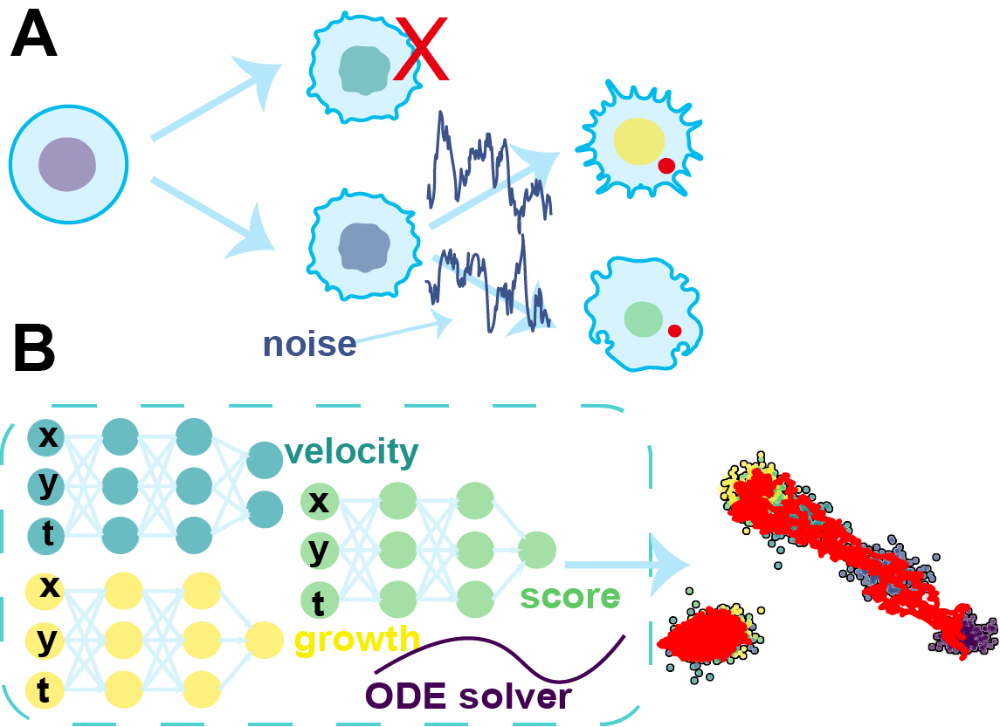

<!-- PROJECT LOGO -->

<h3 style="text-align: left; font-size: 30px;"> Welcome to DeepRUOT‘s documentation
</h3>

# Documentation home
Reconstructing dynamics using samples from sparsely time-resolved snapshots is an important problem in both natural sciences and machine learning. Here, we introduce a new deep learning approach for solving regularized unbalanced optimal transport (RUOT) and inferring continuous unbalanced stochastic dynamics from observed snapshots. Based on the RUOT form, our method models these dynamics without requiring prior knowledge of growth and death processes or additional information, allowing them to be learnt directly from data. Theoretically, we explore the connections between the RUOT and Schrödinger bridge problem and discuss the key challenges and potential solutions. The effectiveness of our method is demonstrated with a synthetic gene regulatory network, high-dimensional Gaussian Mixture Model, and single-cell RNA-seq data from blood development. Compared with other methods, our approach accurately identifies growth and transition patterns, eliminates false transitions, and constructs the Waddington developmental landscape.

  

